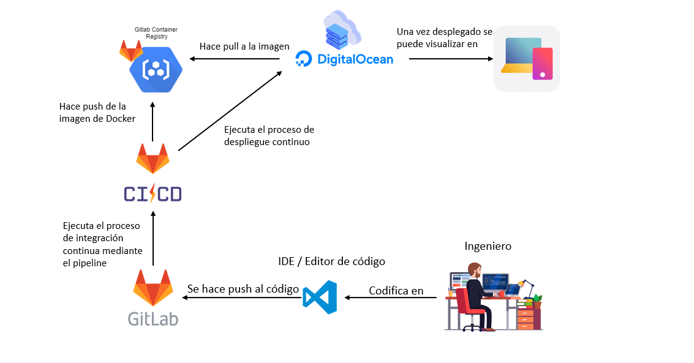

<h1 align="center">
DentiSmart v1.0
  <h4 align="center">DentiSmart un sistema para la gestión de consultorios dentales.</h4>
</h1>

## 🙏 Probar ahora
- 💻 Prueba nuestra [SPA](https://dentismart.ga)
- 💻 Prueba nuestra [REST API](http://dentismart.ga:5000)
- 💻 Prueba nuestra [APK](./DentiSmart.apk)

## ⚡  Características
- Gestión de citas
- Gestión de consultorios
- Gestión de dentistas
- Gestión de productos
- Gestión de servicios
- Gestión de pacientes
- Control de inventario
- Pago de servicios via paypal
- Consulta de tratamientos
- Reporte de historial clinico
- Chat de dudas para los pacientes
- Notificacion de cita via Whatsapp
- Reportes de gastos y ventas

## 📝 Diagrama de despligue

## 💾 Instalación
- Instalación SPA Vue:
1. instalar dependencias : `npm install`
2. Correr el proyecto:  `npm run serve`
- Instalación API .NET CORE:
1. instalar dependencias : `dotnet restore`
2. Correr el proyecto:  `dotnet run`

## 👨‍💻👩‍💻 Equipo
| Integrantes| Número de Control | Hora |
| ---------- | ----------------- | ---- |
|Aguirre Castro Andres | 16171270 | 9:00 - 10:00 |
|Barraza Lugo Francisco Antonio | 16171290 | 9:00 - 10:00 |
|Cortez Esparza Eduardo Alejandro | 16171324 | 9:00 - 10:00 |
|Díaz Villegas Francisco Javier | 16171330 | 9:00 - 10:00 |
|Félix Ramírez Jesús Efraín | 16171335 | 9:00 - 10:00 |
|Reyes Peña Pedro Cesar | 16171469 | 9:00 - 10:00|

## 👨‍🏫 Profesor
- Ing. Jorge Guillermo Moya Palazuelos.

## 🥉 Carrera
- Ingenieria En Sistemas Computacionales.

